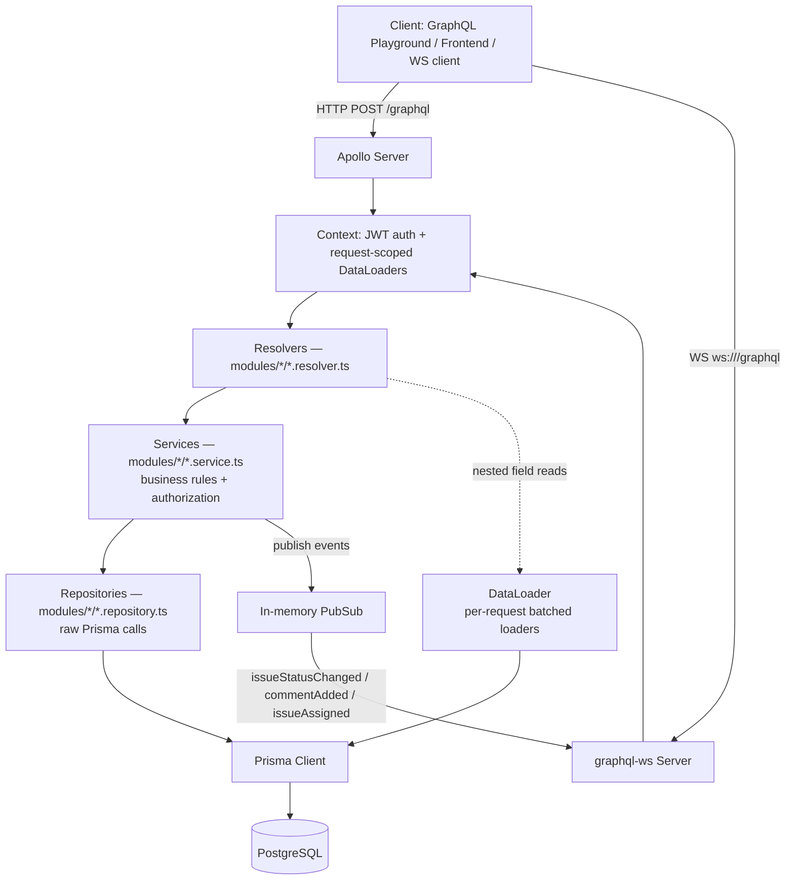

# DevConnectQL — Production-Style GraphQL Collaboration API

[](https://github.com/OMCHOKSI108/GraphQL_DevConnect/actions/workflows/ci.yml)

A developer collaboration / project-management API — a mini GitHub-meets-Jira backend
— built to demonstrate production-grade GraphQL backend engineering: authentication,
authorization, performance optimization, real-time updates, and clean service-oriented
architecture.

## Why GraphQL here?

This domain is a natural fit for GraphQL rather than REST:

- **Nested, relational data.** A single screen might need a project, its members (with
  their roles), its issues (with assignees and comments), and the comment authors — one
  GraphQL query replaces several REST round-trips.
- **Selective fields.** Clients ask for exactly the fields they render (e.g. just
  `title` and `status` for a list view vs. the full issue with comments for a detail
  view) without over- or under-fetching.
- **Real-time collaboration.** Issue status changes, new comments, and assignments are
  pushed live via GraphQL subscriptions instead of polling.
- **Deeply nested relationship queries.** Project → members → user → assigned issues →
  comments is expressed as one query shape instead of N manually-orchestrated REST
  calls.
- **Optimized fetching.** DataLoader batches the repeated per-row lookups that nested
  GraphQL queries naturally produce, keeping the database query count constant instead
  of growing with result size (the classic N+1 problem).

## Features

- JWT authentication (register/login, bcrypt password hashing)
- PostgreSQL + Prisma ORM (driver-adapter client, no native query engine binary)
- GraphQL queries, mutations, and subscriptions (Apollo Server 5 + `graphql-ws`)
- Cursor-based pagination (Relay-style connections: `edges`, `pageInfo`, `totalCount`)
- Filtering and sorting on projects and issues
- DataLoader-based N+1 query optimization
- Structured, typed errors (`AUTHENTICATION_REQUIRED`, `FORBIDDEN`, `NOT_FOUND`,
  `VALIDATION_ERROR`, `CONFLICT`, `INTERNAL_SERVER_ERROR`)
- Project-level role-based access control (OWNER / MAINTAINER / MEMBER), distinct from
  the global user role (DEVELOPER / MAINTAINER / ADMIN)
- Issue assignment with project-scoped authorization
- Threaded comments per issue
- Docker & Docker Compose for local and production-style deployment
- GitHub Actions CI (build, schema validation, automated tests)
- Automated test suite (Vitest) covering auth, RBAC, pagination, filtering, errors,
  and subscriptions

## Tech stack

| Layer            | Technology                                   |
| ----------------- | --------------------------------------------- |
| Language          | TypeScript (Node.js, ESM)                     |
| API layer         | Apollo Server 5, GraphQL                      |
| Real-time         | `graphql-ws`, `ws`, `graphql-subscriptions`   |
| Database          | PostgreSQL                                    |
| ORM                | Prisma 7 (driver adapter via `@prisma/adapter-pg`) |
| Auth               | JWT (`jsonwebtoken`), `bcryptjs`              |
| Performance        | `dataloader`                                  |
| HTTP server        | Express 5                                     |
| Testing            | Vitest                                        |
| Containerization   | Docker, Docker Compose                        |
| CI                 | GitHub Actions                                |

## Architecture



**Request lifecycle:** an HTTP request hits Apollo Server, which builds a fresh
`GraphQLContext` per request (JWT verified → `AuthUser` + a fresh set of DataLoaders).
Resolvers are thin bindings that call into a service function, which enforces
authorization rules and calls a repository function for the actual Prisma query.
Nested field resolvers (e.g. `Issue.createdBy`, `Project.owner`) read from the
request-scoped DataLoaders instead of issuing a fresh query per row. Mutations that
change shared state (`updateIssueStatus`, `assignIssue`, `addComment`) publish to an
in-memory PubSub, which `graphql-ws` subscribers are listening on.

## Database schema

Defined in `server/prisma/schema.prisma`.

| Model           | Purpose                                                                 |
| ---------------- | ------------------------------------------------------------------------ |
| `User`           | Account + global `Role` (`DEVELOPER` / `MAINTAINER` / `ADMIN`)         |
| `Project`        | Has one `owner` (`User`) and many `members` (`ProjectMember`)          |
| `ProjectMember`  | Join table between `Project` and `User`, carrying a project-scoped `ProjectRole` (`OWNER` / `MAINTAINER` / `MEMBER`) |
| `Issue`          | Belongs to a `Project`; has `createdBy`, optional `assignedTo`, `status`, `priority` |
| `Comment`        | Belongs to an `Issue` and an `author` (`User`)                         |

Indexes (`@@index([createdAt, id])` and similar compound indexes on `Project`,
`Issue`, and `Comment`) exist specifically to keep cursor-pagination's
`ORDER BY createdAt, id` queries index-backed rather than full table scans.

See [`docs/database-schema.md`](docs/database-schema.md) for full field-by-field
detail and relationship diagrams.

## RBAC rules

There are **two independent role systems**:

- **Global `Role`** on `User`: `DEVELOPER` / `MAINTAINER` / `ADMIN`. `ADMIN` is a
  site-wide superuser override on every authorization check below. Global
  `MAINTAINER` does **not** imply project-level maintainer status.
- **Project-scoped `ProjectRole`** on `ProjectMember`: `OWNER` / `MAINTAINER` /
  `MEMBER`. These only apply within the specific project the membership row belongs
  to.

| Action                          | ADMIN | Project OWNER | Project MAINTAINER | Project MEMBER | Outsider |
| -------------------------------- | :---: | :------------: | :------------------: | :--------------: | :--------: |
| View public project/issue lists  | ✅    | ✅              | ✅                    | ✅                | ✅          |
| Create an issue in the project    | ✅    | ✅              | ✅                    | ✅                | ❌          |
| Update progress on an issue assigned to them | ✅ | ✅ (if assignee) | ✅ (if assignee) | ✅ (if assignee) | ❌ |
| Close an issue                   | ✅    | ✅              | ✅                    | only if creator   | ❌          |
| Assign an issue to a project member | ✅ | ✅              | ✅                    | ❌                | ❌          |
| Add a member to the project       | ✅    | ✅              | ❌                    | ❌                | ❌          |
| Delete the project                | ✅    | ✅              | ❌                    | ❌                | ❌          |
| View the full `users` list        | ✅    | ❌              | ❌                    | ❌                | ❌          |

See [`docs/rbac-rules.md`](docs/rbac-rules.md) for the full rule-by-rule breakdown
with the exact resolver/service functions that enforce each rule.

## GraphQL examples

All examples assume the API is running at `http://localhost:4000/graphql`. After
`login`/`register`, pass the returned token as `Authorization: Bearer <token>`.

```graphql
mutation Register {
  register(input: { name: "Alice", email: "alice@example.com", password: "password123", skills: ["GraphQL"] }) {
    token
    user { id name role }
  }
}

mutation Login {
  login(input: { email: "alice@example.com", password: "password123" }) {
    token
  }
}

query Me {
  me { id name email role }
}

mutation CreateProject {
  createProject(input: { title: "DevConnectQL", description: "desc", techStack: ["GraphQL"], ownerId: "<your-user-id>" }) {
    id
    title
    members { role user { name } }
  }
}

mutation AddProjectMember {
  addProjectMember(projectId: "<project-id>", userId: "<user-id>", role: MEMBER) {
    role
    user { name }
  }
}

mutation CreateIssue {
  createIssue(input: { projectId: "<project-id>", title: "Fix bug", description: "desc" }) {
    id
    title
    status
    priority
  }
}

mutation AssignIssue {
  assignIssue(issueId: "<issue-id>", userId: "<member-user-id>") {
    id
    assignedTo { name }
  }
}

mutation UpdateIssueStatus {
  updateIssueStatus(issueId: "<issue-id>", status: IN_PROGRESS) {
    id
    status
  }
}

mutation AddComment {
  addComment(issueId: "<issue-id>", message: "Looks good!") {
    id
    message
  }
}

query PaginatedProjects {
  projects(first: 10, after: null, sort: { field: CREATED_AT, direction: DESC }) {
    edges { cursor node { id title } }
    pageInfo { hasNextPage endCursor }
    totalCount
  }
}

query FilteredSortedIssues {
  issues(
    filter: { status: OPEN, assignedToMe: true }
    sort: { field: PRIORITY, direction: DESC }
  ) {
    edges { node { id title priority status } }
  }
}

subscription IssueStatusChanged {
  issueStatusChanged(projectId: "<project-id>") {
    id
    status
    title
  }
}
```

More examples (with variables and header formats) live in
[`docs/graphql-examples.md`](docs/graphql-examples.md).

## Setup locally

```bash
git clone <your-fork-url> devconnectql
cd devconnectql/server
npm install

cp .env.example .env
# edit .env: set DATABASE_URL, JWT_SECRET, CORS_ORIGIN

cd ..
docker compose up -d postgres   # or run your own local Postgres

cd server
npx prisma migrate dev
npm run db:seed
npm run dev
```

The API is now available at `http://localhost:4000` (HTTP) and
`ws://localhost:4000/graphql` (subscriptions).

## Docker setup

To run the full stack (Postgres + API) in containers:

```bash
docker compose up --build
```

This builds the production image (multi-stage: install → `prisma generate` →
`tsc` build → slim production stage with only prod dependencies), waits for
Postgres to report healthy, applies pending migrations automatically via the
container's entrypoint, then starts the API.

After it's up:

- `http://localhost:4000` — welcome message
- `http://localhost:4000/health` — health check
- `http://localhost:4000/graphql` — GraphQL endpoint

### Deploying to Render

The repo root includes `render.yaml` — a [Render Blueprint](https://render.com/docs/blueprint-spec)
that provisions the API (built from `server/Dockerfile`) and a managed
PostgreSQL database together. Push to GitHub, then in Render: **New →
Blueprint**, pick the repo, and click **Apply**. `JWT_SECRET` is generated
automatically and `DATABASE_URL` is wired to the new database — no manual
secret-juggling required. See [`docs/deployment.md`](docs/deployment.md) for
the full walkthrough and what to change before going to production
(`CORS_ORIGIN` in particular).

See [`docs/deployment.md`](docs/deployment.md) for Render/Railway notes and
troubleshooting.

## Testing

```bash
cd server
npm test            # run once
npm run test:watch  # watch mode
npm run test:coverage
```

Tests run against a dedicated `devconnectql_test_db` Postgres database (configured
in `vitest.config.ts`) and execute real GraphQL operations against the schema —
covering auth, project/issue CRUD, pagination, filtering/sorting, the full
`assignIssue` RBAC matrix, comments, subscriptions, and structured error shapes.

```bash
npm run build   # tsc, must pass with zero errors
```

## Environment variables

Defined in `server/.env.example`:

| Variable        | Purpose                                                        |
| ---------------- | ----------------------------------------------------------------- |
| `PORT`           | HTTP port the API listens on (default `4000`)                  |
| `NODE_ENV`       | `development` / `production` / `test`                          |
| `DATABASE_URL`   | PostgreSQL connection string                                     |
| `JWT_SECRET`     | Secret used to sign/verify JWTs — **must** be overridden in production |
| `CORS_ORIGIN`    | Allowed CORS origin(s), comma-separated, or `*` for any         |

Never commit a real `.env` file — only `.env.example` (with placeholder values) is
tracked in git.

## Project structure

```
devconnectql/
├── docker-compose.yml          # postgres + api services
├── render.yaml                 # Render Blueprint (API + managed Postgres)
├── docs/                       # architecture, RBAC, schema, examples, deployment
├── .github/workflows/ci.yml    # GitHub Actions pipeline
└── server/
    ├── Dockerfile               # multi-stage production build
    ├── docker-entrypoint.sh     # runs migrate deploy, then starts the server
    ├── prisma/
    │   ├── schema.prisma
    │   ├── migrations/
    │   └── seed.ts
    ├── src/
    │   ├── app.ts               # Express + Apollo + graphql-ws wiring
    │   ├── server.ts            # process entrypoint
    │   ├── config/              # env, Prisma client singleton
    │   ├── graphql/             # typeDefs, resolvers aggregator, schema, pubsub, context
    │   ├── loaders/             # DataLoader factory
    │   ├── modules/
    │   │   ├── auth/
    │   │   ├── users/
    │   │   ├── projects/
    │   │   ├── issues/
    │   │   └── comments/
    │   │       # each module: repository.ts (Prisma calls) /
    │   │       # service.ts (business rules + authorization) /
    │   │       # resolver.ts (thin GraphQL binding)
    │   └── utils/                # auth helpers, structured errors, pagination
    └── tests/                    # Vitest suite + test helpers
```

## Learning outcomes

This project demonstrates:

- **GraphQL schema design** — Relay-style connections, input types, enums, and a
  Subscription type alongside Query/Mutation.
- **Resolver/service/repository separation** — resolvers stay thin; business rules
  and authorization live in services; Prisma calls are isolated in repositories.
- **Authorization design** — moving from a single global role check to
  resource-scoped, per-action permission functions (`canCreateIssue`,
  `canUpdateIssueProgress`, `canCloseIssue`, `canAssignIssue`, `canDeleteProject`,
  `canAddProjectMember`).
- **Performance optimization** — recognizing and fixing the N+1 problem with
  request-scoped DataLoader batching.
- **Real-time API design** — wiring `graphql-ws` alongside a traditional HTTP GraphQL
  server on a shared `http.Server`, with topic-scoped pub/sub and subscribe-time
  authorization.
- **Production readiness** — structured error codes, Docker multi-stage builds,
  CI, environment-based configuration, and an automated test suite.

## Author

**Om Choksi**
GitHub: [OMCHOKSI108](https://github.com/OMCHOKSI108)
